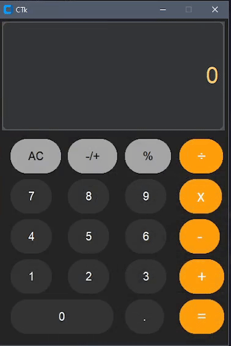

# CustomTkinter Calculator 🖩  

A simple calculator built using **CustomTkinter** in Python, featuring a modern UI and essential arithmetic functions.  

## 🚀 Features  
- **Basic Operations**: Addition (+), Subtraction (-), Multiplication (×), and Division (÷).  
- **Percentage Calculation (%)**: Quickly calculate percentages.  
- **Toggle Sign (±)**: Switch between positive and negative numbers.  
- **AC (All Clear)**: Reset the calculator input.  
- **Responsive UI**: Built with `CustomTkinter`, offering a sleek and modern design.  

  
## 📸 Screenshot  

 

## 🔧 Installation & Usage  
1. **Clone the repository**  
   ```sh
   git clone https://github.com/ukihunter/CustomTkinter-Calculator.git
   cd CustomTkinter-Calculator
